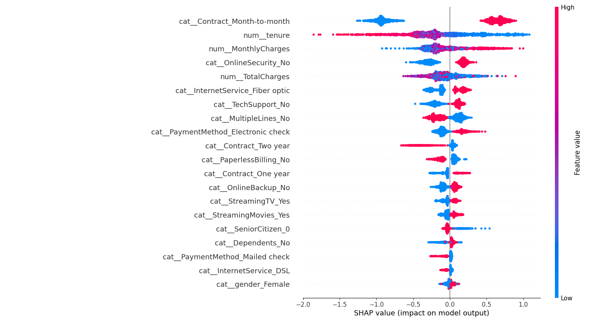
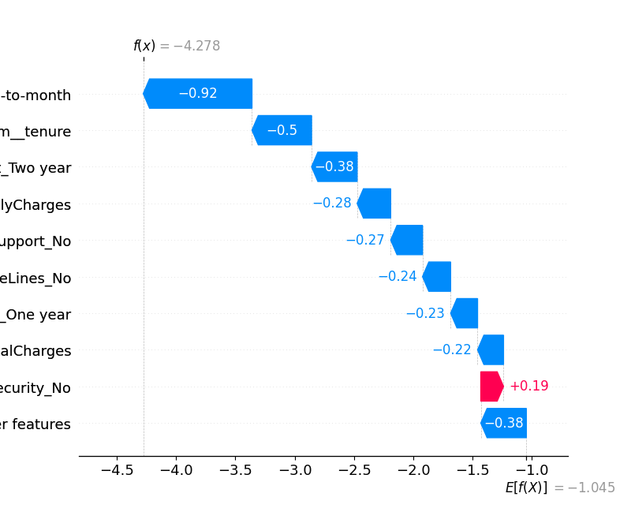

So now i have basic `LogisticRegression` model but now i need to try with few models and pick best model.


## Understanding False negatives and False Positive for this problem
- False Negative: model predicted "won't churn" but they actually did → we lost a customer we could've saved
- False Positive: model predicted "will churn" but they didn't → we wasted a retention offer on a loyal customer

Here most costly thing is *false nagatives* since we lost long term recuring revenue..

Now based on that we have to pick better metric to see which model is better.

### Why here *Accuracy* is not good option?
lets say we have 1000 customers and 150 of them churned. but our dumb model predicted `no churn` for all customers. still it is 85% Accurate. so that means `Accuracy` is not option here. 

**Then what should we use? Precision or Recall**
- Recall = out of all actual churners, how many did we catch?
- Precision = out of all the customers we predicted would churn, how many actually did?

since we need to track *false negatives* we have to use **Recall** As our decision metric.

But We also don't want to flag every customer as churning → so we'll also track F1-score (balance of Precision + Recall) as a sanity check

So now let's try few models and pick best model. 

#### So what we going to do is,
- Use multiple models
- Cross-validation instead of a single split
- Ranking models by Recall, with F1 as secondary

##### What is cross-validation? (k fold cross-validation)

- k = the number of folds (splits) choosen. 

Each fold takes a turn being the test set while the rest trains. we get k scores, then average them.

**Why is this better than your current single split?** Because right now if we got 0.82 ROC-AUC, we don't know if that's because our model is genuinely good, or if we just got a lucky split where the easy cases landed in the test set.
Cross-validation gives us a distribution of scores. Something like: `[0.81, 0.83, 0.79, 0.84, 0.82]` — now we know the average AND the variance. That variance tells us how stable our model is.

now Iam going to update `train.py` with this.

---
***Few points about cross-validation***

Cross-validation is for comparing and selecting models before you commit to one. Your current `model_pipeline.fit()` is training the final chosen model.

Think of it this way:
- **Cross-validation** = "which model should I pick?" → runs on training data only
- **Final fit + test set evaluation** = "how good is my chosen model?" → happens once at the end

If you run cross-validation after training on all data, you've already used the test set information. That's called **data leakage** — your evaluation is no longer trustworthy.

So the order should be:
1. Split into train/test
2. Cross-validate multiple models on train data only → pick the winner
3. Train the winner on full train data
4. Evaluate once on test data → this is your final honest score


in cross validation loop we set `return_train_score=True`. that used for checking overfitting. 
also we have another **rule of thumb** concept to check overfitting.
we check for gap between train recall and test recall. if gap between them is greater than 10, then we say that model is overfitted.

---
# Threshold tuning
After cross validation loop we need to do threshold tuning. we have to pick best value based on experimentation.

in default our models use `threshold` of 0.5. that means if model says there is **50%+** chance of churning it predicts *yes* (says customer churns)

But with different business cases we have to consider best value for this threshold.

here what is more costly for us? **missing a churner is more costly for us**. that means we need to find customers that really churns. 
It is ok to get false ***yes*** but we dont like to get **No** for customer that actually churns.

Since we can accept *False Yes* we can simply reduce threshold to something like 0.3. then what happen is model predicts **yes** more aggresively. but it will more likely to catch actual churners also.

So this will increase **Recall** value and decrease **Precision** Value.

But here we consider **Recall**. So reducing threshold improves Recall. that means it actually helps us to catch things that mostly hurts to us(actual churners hurt us more)

because For churn, we want to lean toward lower threshold. The business would rather send a retention offer to 10 extra loyal customers than miss 1 real churner.

##### Now how we actually find best threshold value? we cant randomly try values

that is why we have **Precision-Recall curve**. It plots Precision vs Recall across every possible threshold so we can visualise the tradeoff and pick the sweet spot.

In the curve we look for position that gets higher recall for us(since here we care about recall more) but also giving good precision.
*check runninng `threshold_tuning.py`*. 
here we inspect good point to have(good recall value) roughly and then write code by defining **target_recall**. then we find correct threshold via also code. not by guessing.

After picking threshold we need to save it. we have two ways.
- one is saving it inside the model. but then we have to train model again if need to change threshold
- save in seperate json file alongside model.

here best option is saving to json. because then we can simply change threshold value from there whenever we need to change it.

we save precision value alongside it because when someone look for our model, then they can understand that we dont picked threshold arbitarily or completely based on recall. then they know that we also accounted for precision.

---

# SHAP
This is used to explain why model predicted a output. so we can understand which features impacted for model output.

*We always use Shap for test data, and we see how features impacted for outputs*

so here we have to load the preprocessor alongside model. because before predicting we have to preprocess our test data. so basic code for shap looks like this after loading data and spiliting them out.

```
# -----------------------------
# LOAD MODEL
# -----------------------------

pipeline = joblib.load(model_path)

preprocessor = pipeline.named_steps["preprocessor"]
model = pipeline.named_steps["model"]


# -----------------------------
# TRANSFORM TEST DATA
# -----------------------------

X_test_transformed = preprocessor.transform(X_test)

# -----------------------------
# SHAP EXPLAINER
# -----------------------------

explainer = shap.TreeExplainer(model)
shap_values = explainer.shap_values(X_test_transformed)
```
#### Points
- Note we're using `TreeExplainer` — this is specific to tree based models like XGBoost. Different model types need different explainers. We have to Keep that in mind.
- also here now `X_test_transformed` is a numpy array now, not a DataFrame. The column names are gone. But our preprocessor remembers all the features. Actually it not remember original columns. it remembers columns that after encoding. so that means it increased column count. *for example if there is categorical column with 3 unique values then for that feature one hot encoding will create 3 columns. for 5 unique items it creates 5 columns. but we can also drop one column for binary features (lets handle that later)* so that means it increases column count.
here we got 53 columns after encoding.
Also we have to keep in mind that after encoding how column names change like `"Contract" with 3 unique values becomes 3 separate binary columns: Contract_Month-to-month, Contract_One year, Contract_Two year. `

#### How to read SHAP values?



Each dot is one customer from your test set. The X axis is the SHAP value — how much that feature pushed the prediction toward churn (positive) or away from churn (negative). 
**The colour is the feature value**
 - red = high,
 -  blue = low.

**Examples**
- So look at `cat__Contract_Month-to-month`. Red dots are on the right (positive SHAP). That means: high value of this feature (= is month-to-month) strongly pushes toward churn. Makes perfect sense.
- Now look at `num__tenure`. Red dots are on the left. High tenure pushes away from churn. Long-term customers are loyal.
- Look at `cat__OnlineSecurity_No`, it makes customers churn more since red dots are in right. but not impactful as month-to-month
- Our engineered feature `HighRiskContract` doesn't appear in the top features, but `cat__Contract_Month-to-month` does. What could be the reason for this?
`HighRiskContract` isn't useless, it is *month-to-month* customers encoded as 0/1.
The issue is that our preprocessor then OneHotEncoded it again, creating `cat__HighRiskContract_0` and `cat__HighRiskContract_1`. Meanwhile the original Contract column also exists as `cat__Contract_Month-to-month.`
So we essentially have the same information twice. The model already gets everything it needs from the original Contract column — our engineered version added no new signal.

This is a really important lesson: **feature engineering only adds value when it captures something the raw features don't already express.**

*our other features though — TotalServices, IsNewCustomer, HasProtection — those do add value because they combine multiple columns into a single signal the model couldn't easily derive itself.*

- for `cat__InternetService_Fiber optic`. Red dots are on the right. Fiber optic customers churn more. But Why?
  - fiber optic customers are likely more tech-savvy, which means they actively compare competitors and switch when they find a better deal. DSL customers might just stick with what works.
  
**So these type of analysis can be made from the SHAP value grapjh**


#### Now let's talk about what's missing from our SHAP analysis that makes it incomplete for a real product.
Right now we  have a global summary — feature importance across all customers. But a telecom retention team doesn't work with averages. They work with individual customers. They want to know: *Why is this specific customer predicted to churn?*

SHAP can do that too with a **force plot** — it shows exactly which features pushed a single customer's prediction up or down.

- example
```python
X_test_df = pd.DataFrame(
    X_test_transformed,
    columns=feature_names
)
# Single customer explanation
idx = 0  # first customer in test set
shap.plots.waterfall(explainer(X_test_transformed)[idx])
```

here first converted `X_test_transformed` into dataframe with column names. and then we ploted force plot.



Now we can read it properly. And this customer's story is actually really clear.

Everything is blue (pushing toward no churn). Look at the top factors:
- Not on month-to-month contract (-0.92)
- High tenure (-0.50)
- Two year contract (-0.38)
  
This customer is clearly a loyal, long-term customer on a two-year contract. The model is very confident they won't churn, **f(x) = -4.278** is far into the negative (no churn) territory.

The one red bar, `OnlineSecurity_No (+0.19)` — is a tiny churn signal but completely overwhelmed by loyalty factors.

so here SHAP saved the business from wasting a retention call on a loyal customer. Multiply that across thousands of customers and you're saving serious money and effort.

**So now we know how to use SHAP analysis also to get business insights**
Next lets move to create `evaluate.py`

