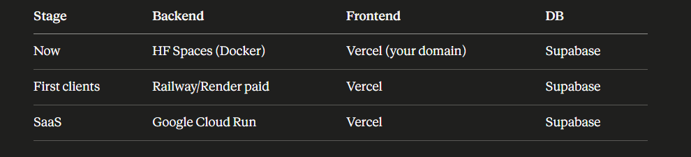

we will host frontend in my custom domain.

# Host backend
to host backend we will first containerize it using docker.

Hugging Face Spaces with Docker is your best option for the backend. Here's why it beats the others for your use case:

- 16GB RAM — your XGBoost model is tiny, you'll use maybe 500MB
- Free with no credit card
- Supports FastAPI via Docker natively
- Each Space is a repository with code and configuration — Hugging Face builds and runs the app and gives you a public URL
- The 48h deep sleep is manageable for a portfolio project — a simple uptime ping service like UptimeRobot can keep it awake for free

